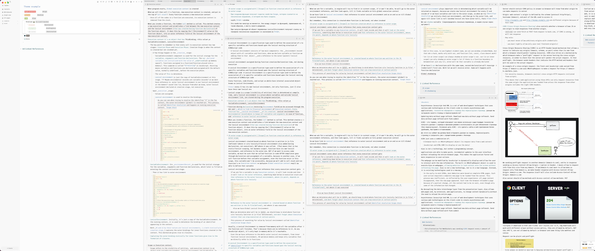
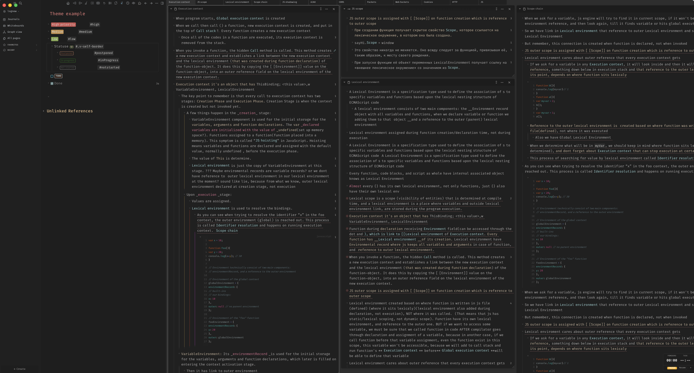

# Logseq styles

Custom styles for Logseq.

Install `Fira Code` before using these styles, since the theme is configured to use that font.

In dark mode with Logseq panes mode, you will need to change the plugin settings to adjust the background colors.
